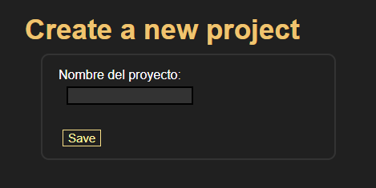
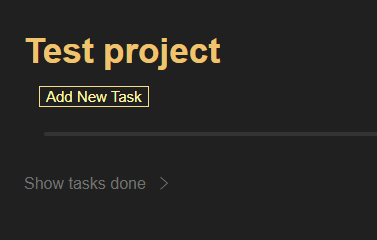
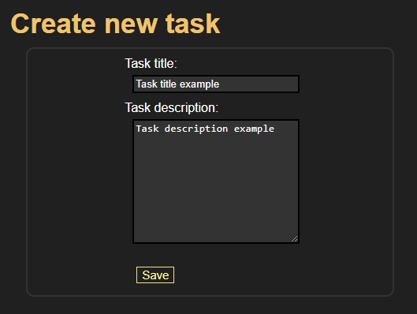
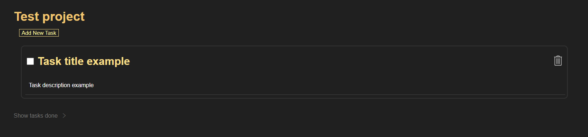

# TaskManager
## First steps

To get started, navigate to the My Projects page where you can create a new project.

Once your new project is saved, you will be redirected to the Projects page, where you will see your newly created project.
Click on the project name to enter it. Once inside, you can create new tasks related to the project.

When creating a task within a project, you are required to give it a name. The description is optional.

After creating the task, you will be taken to your project page, where your task will be waiting for you.

On every page except the main page, you will find a back arrow. This arrow allows you to return to the previous page.

## Updates
I will be updating this repository on the dev branch. When a new stable version is available, I will push it to main.